# Final Project Report - P2P Download

*Leader: 田闰心 11610734*

*Teammate: 李晨 11610709, 刘嘉伟 11610232*

## Introduction
We achieved a lot about our project in designing a P2P download protocol.
*To simplify the web and host-communication, we use `flask` module[1].*
We divided our project into three parts: **client**, **tracker** and **torrent**. In the client part, we design a website page for downloading and uploading files and giving a display about the information of files distribution. And also, the `upload` and `download` functions are written in the client. In the third part, **torrent** is achieved, which contain the creation of torrent and p2t files. In the tracker, we use `query` function to query the sender from tracker and use the `report` function to report the torrent status to tracker.

## Usage & Demo
#### **Download dependency**

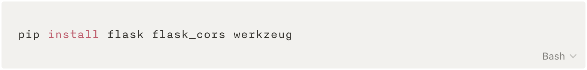

#### **Modify tracker IP**

*The function of a tracker is to track and record the file(torrent) status among the whole p2p network. And in our project, we statically write the ip address in our code.*

In ./client/templates/index.html

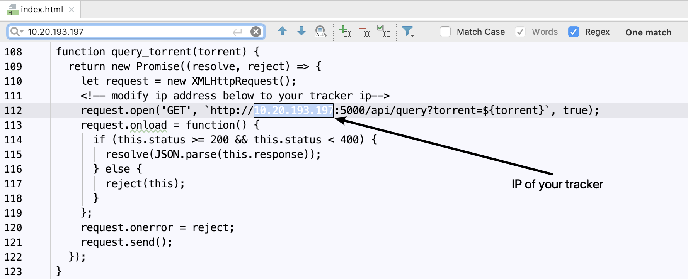

In ./client/__main__.py

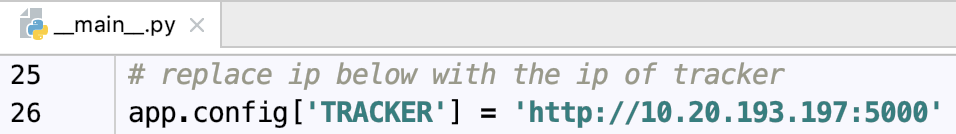

#### **Start the tracker**

*choose a device(host) to run the tracker*

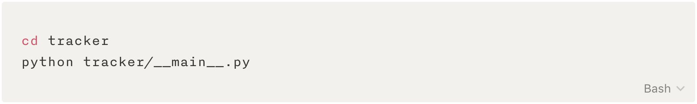

#### **Open the xx.xx.xx.xx:5000 in browser**

*to verify whether the tracker is running.
xx.xx.xx.xx is the LAN ip of the host running the tracker/__main__.py*

*Not 127.0.0.1(local host) or 0.0.0.0 !*

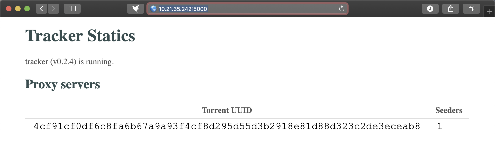

#### **Start the client**

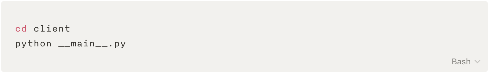

#### **Open the xx.xx.xx.xx:5001 in browser**

*xx.xx.xx.xx is the LAN ip of the host running the client/__main__.py*

*Not 127.0.0.1(local host) or 0.0.0.0 !*

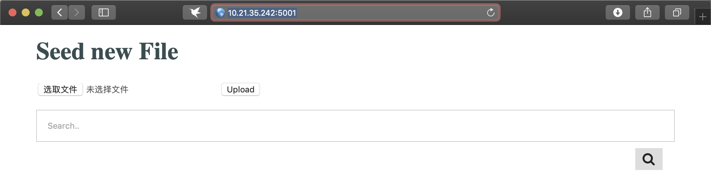

#### **Upload a file or search a file**

*click `upload` button to upload a file,*

*input (copy paste) the hash value (digest) of a file and search*

## Architecture

The file structure is shown as below.

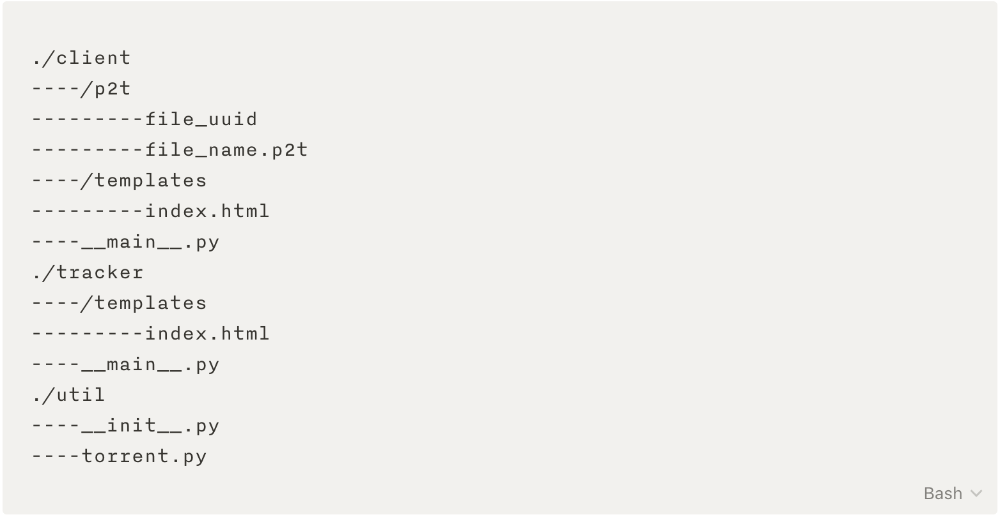

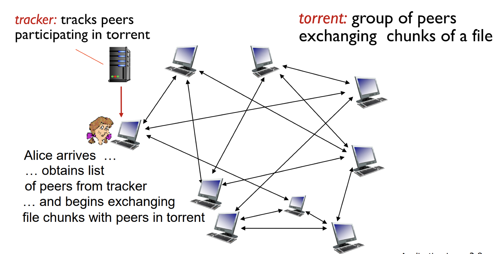

### Torrent

In ./utils/torrent.py, we designed a class `Torrent` , which represents the conversion we apply to a file.

**Attributes**

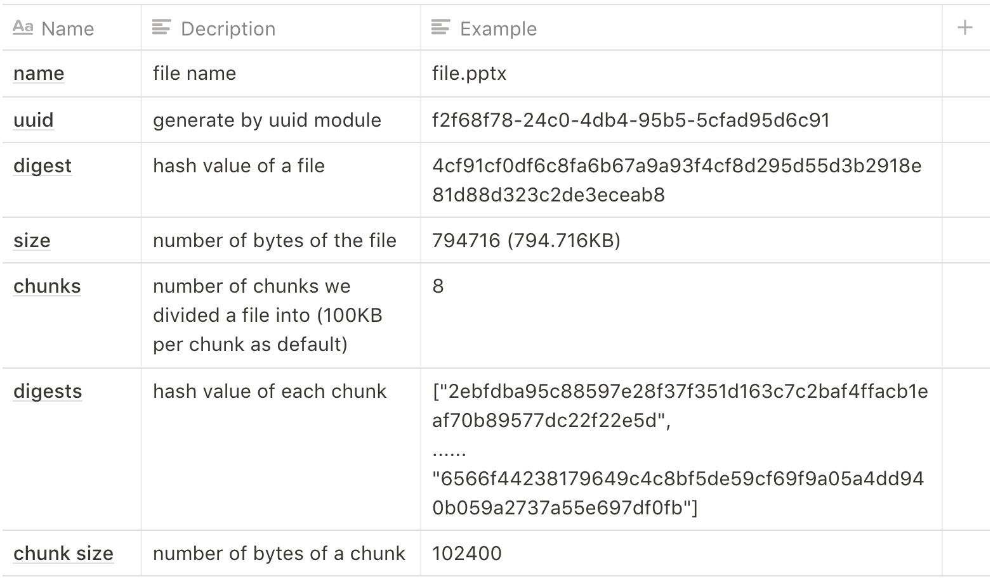

To bind these information with corresponding file, in the same time a client completed file uploading, we would generate a p2t file which contains upper attributes in json format.

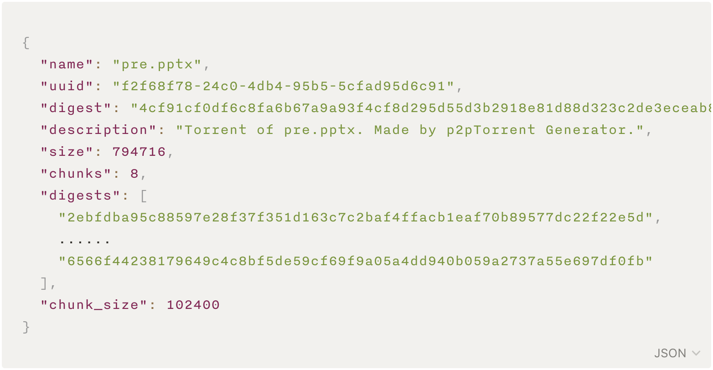

### Tracker

In order to spread the information of the torrent file and build a connection among peers, a tracker is needed to record torrents' information and become a platform for peers to get information and build connection between each other.

To maintain the upper information, a dictionary is defined in the tracker, which is a relationship from the uuid of the file and the seeders information (etc. ip, torrent url...). The dictionary is update when there is a upload file request from a peer.

Using this dictionary, a tracker should have two functions: `report` and `query` . The report function is invoked while there is a peer uploading a file, and the function would return the status of the `report` or the uploading process is success or not. And the `query` function is invoked while there is a peer wants to search a file with the hash value (digest) of a file, and the `query` fuction would return the seeders (the peers have corresponding torrent) list in json format.

- **report**

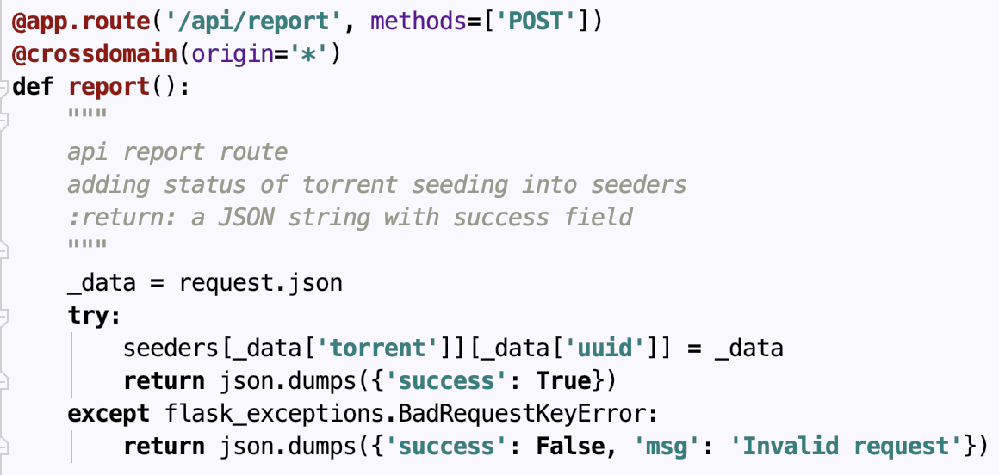

- **query**

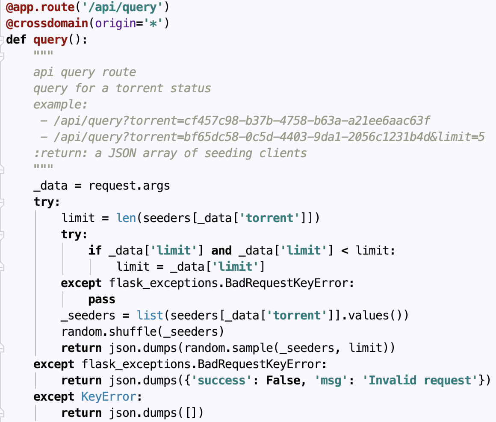

### Client

Based on upper description, the two main functions of a client is `upload` and `download` which are the basical functions of a peer in the p2p network.

- **upload**

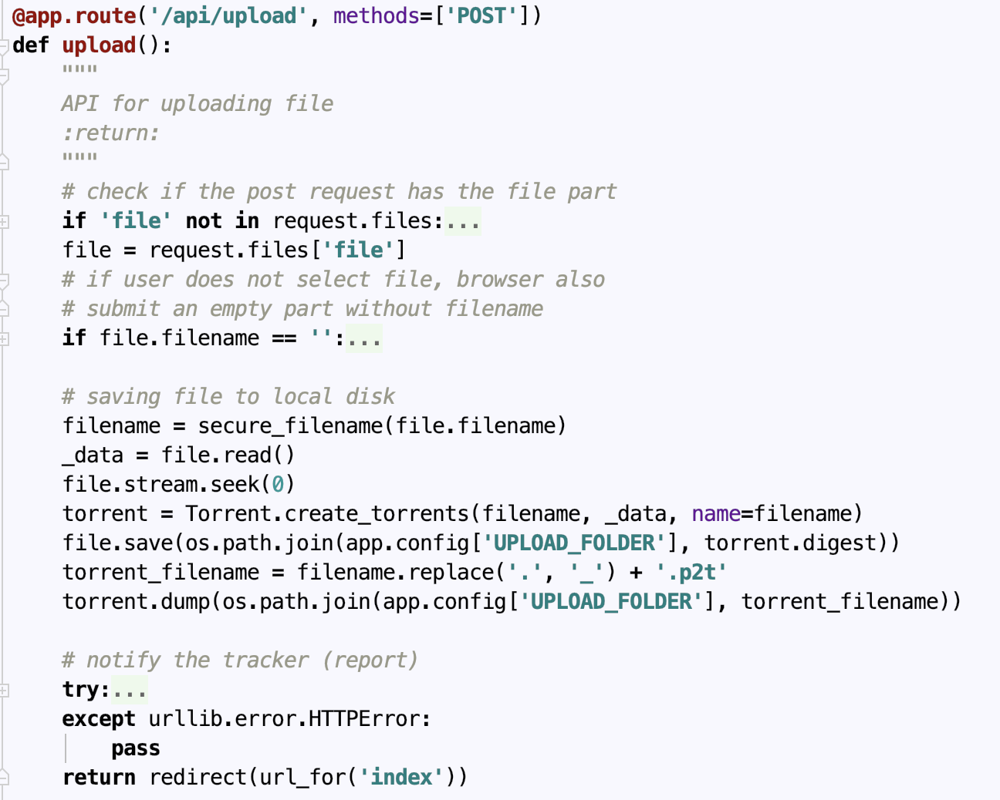

- **download**

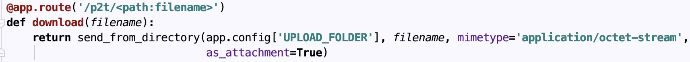

## Download

In fact, the real download implementation is written in the HTML file using javascript. And the download function in the client part is just a function involcation between client and tracker.

As can be seen from the code below, the source of the torrent file that the client requested to download is from all the peers who have the torrent file. And for each chunk, we randomly choose a peer as the provider of the chunk.

Finally, a completed file is composed of all the chunks from peers that w ere randomly chosen.

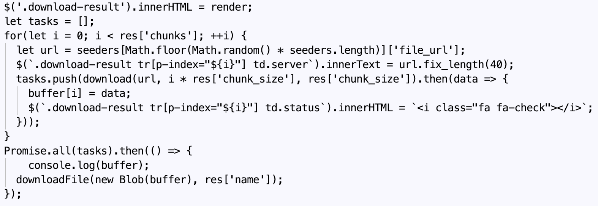

## Future Plan

- Fancy UI
- Statics information display on the tracker's web page.

## Experience Summary

This project is a summary on what we learned in computer network and study about lab experiment based on python programming. In fact, we have no a lot of time to achieve this project better because of heavy other homework and nonproficiency and lack of some relative knowledge. So this project is a challenge for us three, we must divide our project into some small parts properly and communicate with partners in time about the combination of these parts, which is very important in our project and contains: the design of program or function, program implementation path planning and programming, division of program design and cooperation with members and so on. We do not only have a vision about our p2p project, but also it is import for us to design the structure of our project and communication cooperation with others.

## Personal Summary

**Li Chen**: In this project, I have a deep study about this class computer network and the programming based on python. I have a weak ability on python program because of my useless python before. In the entire labs, there is a lot of difficulties for me to complete the homework about program alone, I must ask my friends for help on the programming. When they complain the theories and function used, I can just do it myself. I also need a lot of time to check information. But fortunately, I learned a lot from others and I can have a clear vision on computer network. And also, I can complete the code of ’torrent’ with my partners. I believe that hard work will cause gains.

**Jiawei Liu**: This project is a summary on the study of python programming in this term. In fact, my major is communication engineer, not computer science. So I have some difficulties on programming and have not a clear structure on my program. But I got much help from my friends majoring in computer science, and I got some tips to complete my labs and project. This project made me have more skilled on python, and also some debugs skills and tips. I complete the code of ‘torrent’ with Li Chen and also get involved in the design of website.

**Runxin Tian**: I have few difficulties in labs because I have basics on python programming and major in computer science, but my theory course of p2p is weak. I had to spending much figuring out the basic theory and memory them. In this project, though there is just one student majoring in computer science (it is me), but my partners just had weak abilities on programming, they had a clear knowledge on this project. I completed the ‘tracker’, ’client’ and website with Jiawei Liu. And when some bugs happened , we could communicate in time and solved them. It was a short time for us to complete the p2p distribution, but I with my partners could have effective communications and cooperation, we could achieve this project with good robustness completely.

## Reference

[1]"Welcome | Flask (A Python Microframework)", Flask.pocoo.org, 2018.
[Online]. Available: [http://flask.pocoo.org/.](http://flask.pocoo.org/) [Accessed: 24- Dec- 2018].
